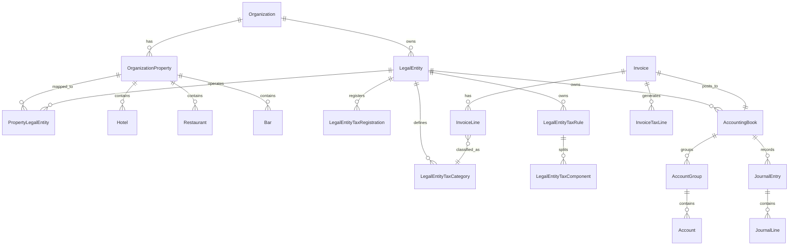

```mermaid
erDiagram

Organization ||--o{ LegalEntity : owns
Organization ||--o{ OrganizationProperty : has

OrganizationProperty ||--o{ PropertyLegalEntity : mapped_to
LegalEntity ||--o{ PropertyLegalEntity : operates

OrganizationProperty ||--o{ Hotel : contains
OrganizationProperty ||--o{ Restaurant : contains
OrganizationProperty ||--o{ Bar : contains

LegalEntity ||--o{ LegalEntityTaxRegistration : registers
LegalEntity ||--o{ LegalEntityTaxCategory : defines
LegalEntity ||--o{ LegalEntityTaxRule : owns
LegalEntityTaxRule ||--o{ LegalEntityTaxComponent : splits

LegalEntity ||--o{ AccountingBook : owns
AccountingBook ||--o{ AccountGroup : groups
AccountGroup ||--o{ Account : contains

Invoice ||--o{ InvoiceLine : has
InvoiceLine }o--|| LegalEntityTaxCategory : classified_as
Invoice ||--o{ InvoiceTaxLine : generates

Invoice ||--|| AccountingBook : posts_to
AccountingBook ||--o{ JournalEntry : records
JournalEntry ||--o{ JournalLine : contains
```
